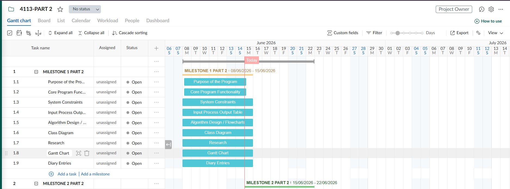

# IY4113 Milestone 1 Part 2

| Assessment Details | Please Complete All Details                                             |
| ------------------ | ----------------------------------------------------------------------- |
| Group              | A                                                                       |
| Module Title       | IY4113 Applied Software Engineering using Object-Orientated Programming |
| Assessment Type    | Java Fundamentals Part 2                                                |
| Module Tutor Name  | Shore, Jonathan                                                         |
| Student ID Number  | P0496112                                                                |
| Date of Submission | 14/06/2026                                                              |
| Word Count         |                                                                         |
| GitHub Link        | https://github.com/ALI-MARDAN-SHAH/IY4113_T0496112_                     |

- [x] *I confirm that this assignment is my own work. Where I have referred to academic sources, I have provided in-text citations and included the sources in
  the final reference list.*

- [x] Where I have used AI, I have cited and referenced appropriately.

------------------------------------------------------------------------------------------------------------------------------

### Purpose of the Program

------------------------------------------------------------------------------------------------------------------------------

The purpose of this program is to extend the CityRide Lite Java console application from Part 1 to a more advanced transport fare companion app. In Part 1 the program focused on recording journeys, calculating fares, applying discounts and managing journeys during one program session. In Part 2 the program will be extended by adding rider profiles and an admin role and file handling. This will allow the system to save and load rider information, import and export journey data, produce reports and manage fare configuration using  JSON and CSV files. The program will still use the main fare calculation ideas from Part 1 but it will now become more real because now data can be stored between sessions and managed by both riders and admins.

---

### Main Functional Requirements

#### 1. Manage user roles

- The program should allow the user to choose between Rider and Admin when the program starts.

- The Rider role should open the normal journey, profile, file handling and report features.

- The Admin role should open a separate password protected admin menu.

- The system should reject invalid role choices and ask the user again.

#### 2. Load system configuration

- The program should load configuration data when the program starts.

- The configuration should include base fares, passenger discounts daily caps and peak time windows.

- If the configuration file is missing the program should use safe default values.

- The system should make sure invalid configuration data is not saved or used.

#### 3. Manage rider profile

- The Rider should be able to create a profile.

- The profile should store the rider name, passenger type, and default payment option.

- The Rider should be able to load an existing profile.

- The Rider should be able to save their profile.

- The rider profile should be saved and loaded using a JSON file.

#### 4. Manage journeys

- The program should store journeys for the active rider and active day.

- Each journey should have its own unique ID.

- Journeys should be kept in the order they were entered or imported.

- The program should allow the rider to add and edit and delete journeys.

- If a journey is edited or deleted then totals and capped fares should be recalculated.

#### 5. Add a journey

- The program should ask the rider for journey details.

- The journey details should include date/time, start zone, destination zone, time band and passenger type.

- The program should check that all journey inputs are valid before adding the journey.

- The program should calculate how many zones the journey covers.

- The journey should then be stored with fare details and a unique journey ID.

#### 6. Edit a journey

- The program should allow the rider to edit an existing journey by entering its journey ID.

- The system should check that the journey ID exists.

- The rider should be able to change journey details such as date/time, zones, time band or passenger type.

- The new details should be validated before the journey is updated.

- After editing a journey the system should recalculate fares, discounts, daily caps and totals.

#### 7. Delete a journey

- The program should allow the rider to delete a journey by using its ID.

- The program should ask for confirmation before deleting the journey.

- If the ID does not exist then the program should show an error message.

- After deleting a journey the totals and capped fares should be recalculated using the remaining journeys.

#### 8. Calculate fare

- The program should calculate zones crossed using the journey zones.

- The program should find the correct base fare using the start zone, destination zone and time band.

- The program should apply the correct passenger discount.

- The program should apply the daily cap for the passenger type.

- The final charged fare should never make the passenger type total go over the daily cap.

- Money calculations should be handled carefully using BigDecimal.

#### 9. Import journeys from CSV

- The Rider should be able to import journeys from a CSV file.

- The system should read each journey row from the file.

- Imported journey data should be validated before being added.

- Invalid imported rows should not be saved into the journey list.

- Valid imported journeys should be added to the active day.

#### 10. Export journeys to CSV

- The Rider should be able to export current journeys to a CSV file.

- The CSV file should include important journey details such as ID, date/time, zones, time band, passenger type, base fare, discount and charged fare.

- The exported file should be useful for keeping a record of the riders journeys.

#### 11. View journey information and running totals

- The Rider should be able to list all journeys.

- The program should show journey details such as ID, date/time, start zone, destination zone, time band, passenger type, zones crossed, base fare, discount and charged fare.

- The program should show running totals for the active day.

- The program should show whether the daily cap has been reached or applied.

#### 12. View and export end of day summary

- The program should display an end of day summary.

- The summary should include the total number of journeys.

- The summary should include the total amount charged.

- The summary should include the average journey cost.

- The summary should include the most expensive journey by charged fare.

- The summary should show whether daily caps were reached.

- The summary should show savings compared to uncapped fares.

- The summary should show category counts such as peak/off-peak journeys and zone counts.

- The summary should be exportable as a CSV report and a human readable text report.

#### 13. Manage admin login

- The Admin menu should be protected by a password.

- The system should check the password before allowing access to admin features.

- If the password is wrong  the system should show an error message and not open the admin menu.

- The admin menu should be separate from the rider menu.

#### 14. Manage system configuration as Admin

- The Admin should be able to view the active configuration.

- The Admin should be able to add, update and delete base fare rules.

- The Admin should be able to add, update and delete passenger discounts.

- The Admin should be able to add, update and delete daily caps.

- The Admin should be able to add, update and delete peak time windows.

- Any admin changes should be validated before being saved.

- Invalid configuration changes should be rejected with clear reasons.

#### 15. Save current day state on exit

- When the user chooses to exit the program should offer to save the riders current day state.

- The saved state should include the active rider profile and current journey data.

- The program should allow the user to exit after saving or exit without saving.

- A clear goodbye message should be shown when the program ends.

---

### System Constraints

The program has these main constraints:

#### 1. Console only

- The program uses a text based menu and keyboard input.

- The program does not use a graphical user interface.

- All prompts should be clear and easy to understand.

#### 2. Java program

- The program must be written in Java.

- The program should be created as an IntelliJ IDEA project.

- The code should use separate classes and packages to keep the structure organised.

#### 3. Two user roles only

- The program only supports two roles: Rider and Admin.

- The Rider role is used for profile, journey, fare, file handling and report features.

- The Admin role is used for configuration management.

- Invalid role choices should not be accepted.

#### 4. Admin password rule

- The Admin menu must be password protected.

- Admin features should not be available unless the correct password is entered.

- Wrong passwords should show an error message.

#### 5. Profile file rule

- Rider profiles should be saved and loaded using JSON.

- A rider profile should include name, passenger type and default payment option.

- The program should not save an invalid profile.

#### 6. Configuration file rule

- The program should load configuration data from a file when it starts.

- Configuration data should include base fares, discounts, daily caps and peak time windows.

- If the configuration file is missing the program should use safe default values.

- Invalid configuration values should not be saved.

#### 7. Journey file rule

- Journeys can be imported from CSV files.

- Current journeys can be exported to CSV files.

- Imported journey rows must be checked before they are added.

- Invalid CSV rows should be rejected or skipped with a clear message.

#### 8. Report file rule

- End of day summaries should be exportable as a CSV report.

- End of day summaries should also be exportable as a readable text report.

- Reports should include the rider name and date where possible.

#### 9. Zone limit

- Zones must be within the valid CityRide zone range.

- Invalid zones should not be accepted.

- Non number zone inputs should show an error message.

#### 10. Time band limit

- Time band must be Peak or Off-peak.

- Unknown time bands should not be accepted.

- Prompts should show the expected format or example values.

#### 11. Passenger type limit

- Passenger type must be Adult, Student, Child or Senior Citizen.

- Unknown passenger types should not be accepted.

- The passenger type should be used for discount and daily cap calculations.

#### 12. Payment option rule

- The rider profile should store a default payment option.

- The program should only accept valid payment options.

- Blank or unknown payment options should not be saved.

#### 13. Fare data rule

- The program should use CityRide fare rules as the base for fare calculation.

- Base fare should be depending on zones and peak/off peak time band.

- Passenger discounts and daily caps should come from the active configuration.

#### 14. Money calculation rule

- Money values should be handled using BigDecimal.

- Fares, discounts, daily caps, charged fares, totals and savings should not be calculated using double.

- Displayed money values should be shown to two decimal places.

#### 15. Daily cap rule

- The total amount charged for each passenger type should not go over its daily cap.

- If a journey would take the total over the cap then only the remaining amount should be charged.

- If the cap has already been reached then later journeys for that passenger type should be charged 0.00.

#### 16. Recalculation rule

- If a journey is edited or deleted then the program should recalculate totals and capped fares.

- The recalculation should be based on the remaining journey list in order so the daily cap totals stay correct.

#### 17. Input validation rule

- Wrong inputs such as blank names, blank dates, wrong zones, non number inputs, wrong passenger type, wrong time band, wrong payment option, invalid ID and invalid file names should not be accepted.

- The program should show a clear error message and ask again where possible.

- On validation failure invalid data should not be saved.

#### 18. Journey ID rule

- Each journey should have a unique ID during the active day.

- The system should reject editing or deleting a journey if the ID does not exist.

- Journey IDs should make it easier to edit, delete and identify journeys in reports.

#### 19. Menu rule

- The program should be menu driven.

- Menus should include clear options for profile, journeys, import, export, reports, save/exit and admin.

- Invalid menu choices should show an error message without closing the program.

#### 20. File error rule

- Missing files, invalid file formats or unreadable files should not crash the program.

- The program should show a useful error message.

- The system should continue running where possible.

---

### 3: Input Process Output Table

---

| Feature / Task               | Inputs                                                             | Processing                                                                                                                                                           | Outputs                                                           |
| ---------------------------- | ------------------------------------------------------------------ | -------------------------------------------------------------------------------------------------------------------------------------------------------------------- | ----------------------------------------------------------------- |
| Start program                | None                                                               | The program starts and creates the main application objects and service objects and It prepares the system to load configuration and show the first menu.            | Program starts and the role menu is prepared.                     |
| Load configuration           | Configuration file                                                 | The program tries to read base fares, discounts, daily caps and peak time windows from the config file and If the file is missing then safe default values are used. | Active configuration is loaded or default configuration is used.  |
| Display role menu            | User role choice                                                   | The program asks the user to choose Rider or Admin and checks if the choice is valid.                                                                                | Rider menu or Admin login is opened or an error message is shown. |
| Open Rider menu              | Rider menu choice                                                  | The program displays rider options such as profile, journeys, import/export, reports, save and exit.                                                                 | Selected rider option opens.                                      |
| Open Admin login             | Admin password                                                     | The program checks the entered password against the expected admin password.                                                                                         | Admin menu opens or an error message is shown.                    |
| Open Admin menu              | Admin menu choice                                                  | The program displays admin options for viewing and changing configuration values.                                                                                    | Selected admin option opens.                                      |
| Create rider profile         | Rider name, passenger type, default payment option                 | The program checks that the name is not blank and that passenger type and payment option are valid then a RiderProfile object is created.                            | New rider profile is created.                                     |
| Load rider profile           | Profile file name or profile path                                  | The program reads rider profile data from a JSON file and checks that the data is valid.                                                                             | Rider profile is loaded or an error message is shown.             |
| Save rider profile           | Active rider profile                                               | The program writes rider name, passenger type and default payment option to a JSON file.                                                                             | Rider profile is saved.                                           |
| Validate passenger type      | Passenger type input                                               | The program checks that the passenger type is Adult, Student, Child or Senior Citizen.                                                                               | Passenger type is accepted or an error message is shown.          |
| Validate payment option      | Payment option input                                               | The program checks that the payment option is valid and not blank.                                                                                                   | Payment option is accepted or an error message is shown.          |
| Add journey                  | Date/time, start zone, destination zone, time band, passenger type | The program collects the journey details, validates the inputs, calculates fare information, applies discount and daily cap, then stores the journey.                | Journey is added and confirmation is shown.                       |
| Validate date/time input     | Date/time input                                                    | The program checks that the date/time is not blank and is in the expected format.                                                                                    | Date/time is accepted or an error message is shown.               |
| Validate zone input          | Start zone and destination zone                                    | The program checks that the inputs are numbers and that both zones are within the valid range.                                                                       | Zones are accepted or an error message is shown.                  |
| Select time band             | User chooses Peak or Off peak                                      | The program converts the user’s menu option or text input into the correct time band value                                                                           | Time band is saved for the journey.                               |
| Calculate zones crossed      | Start zone and destination zone                                    | The program calculates the number of zones included in the journey using the zone calculation rule.                                                                  | Number of zones crossed is calculated.                            |
| Get base fare                | Start zone, destination zone, time band                            | The program uses the active configuration or CityRide fare data to find the correct base fare.                                                                       | Base fare is returned.                                            |
| Apply discount               | Base fare and passenger type                                       | The program gets the discount rate for the passenger type and calculates the discount amount and discounted fare.                                                    | Discount amount and discounted fare are calculated.               |
| Apply daily cap              | Passenger type, discounted fare and running total                  | The program checks if the new journey would go over the daily capand the charged fare is reduced if needed.                                                          | Charged fare is calculated without passing the daily cap.         |
| Store journey                | Valid journey details and fare details                             | The program creates a Journey object, gives it a unique ID and adds it to the active journey list.                                                                   | Journey is stored for the active day.                             |
| List journeys                | Rider menu option                                                  | The program loops through the active journey list and reads each journey.                                                                                            | All journey details are displayed.                                |
| Edit journey                 | Journey ID and updated journey details                             | The program checks if the journey ID exists and it validates the new details and updates the journey and recalculates fares and totals.                              | Journey is updated or an error message is shown.                  |
| Delete journey               | Journey ID and confirmation                                        | The program checks if the journey ID exists and removes the journey if the user confirms and totals and capped fares are recalculated.                               | Journey is deleted, cancelled or an error message is shown.       |
| Recalculate journey totals   | Active journey list                                                | The program clears old running totals and recalculates fares, discounts, charged fares and caps using the remaining journeys in order.                               | Updated journey fares and totals are made.                        |
| Import journeys from CSV     | CSV file name or file path                                         | The program reads journey rows from the CSV file and each row is validated before being added to the journey list.                                                   | Valid journeys are imported and invalid rows are reported.        |
| Export journeys to CSV       | Active journey list and export file name                           | The program writes current journey details to a CSV file.                                                                                                            | Journey CSV file is created.                                      |
| Filter journeys              | Filter type and search value                                       | The program checks saved journeys against the selected filter such as passenger type, time band, zone or date.                                                       | Matching journeys are displayed or a no results message is shown. |
| View running totals          | Active journey list                                                | The program calculates current totals, cap progress and charged fare totals for the active day.                                                                      | Running totals are displayed.                                     |
| End of day summary           | Active journey list                                                | The program calculates total journeys, total charged cost, average cost, most expensive journey, caps reached, savings and category counts.                          | End of day summary is displayed.                                  |
| Export summary as CSV        | Summary data and report file name                                  | The program writes summary information and line items to a CSV report file.                                                                                          | CSV summary report is saved.                                      |
| Export readable text summary | Summary data, rider name and date                                  | The program writes a human readable report that explains the rider’s daily travel summary.                                                                           | Text summary report is saved.                                     |
| View admin configuration     | Active configuration                                               | The program reads current fare rules, discounts, daily caps and peak windows.                                                                                        | Current configuration is displayed.                               |
| Add fare rule                | Zones and time band and fare value                                 | The program validate the fare rule and adds it to the active configuration if valid.                                                                                 | New fare rule is added or an error message is shown.              |
| Update fare rule             | Existing fare rule and new fare value                              | The program checks that the fare rule exists and validates the new value before updating it.                                                                         | Fare rule is updated or an error message is shown.                |
| Delete fare rule             | Fare rule choice and confirmation                                  | The program checks that the fare rule exists and deletes it if confirmed.                                                                                            | Fare rule is deleted or cancelled.                                |
| Manage passenger discounts   | Passenger type, discount value and admin action                    | The program allows the admin to add and update or delete passenger discount values after validation                                                                  | Passenger discount is changed or rejected with an error message.  |
| Manage daily caps            | Passenger type and cap value and admin action                      | The program allows the admin to add and update or delete daily cap values after validation.                                                                          | Daily cap is changed or rejected with an error message.           |
| Manage peak time windows     | Start time, end time and admin action                              | The program allows the admin to add and update or delete peak time windows after validation.                                                                         | Peak time window is changed or rejected with an error message.    |
| Save configuration           | Active configuration                                               | The program writes the current configuration values to a config file.                                                                                                | Configuration file is saved.                                      |
| Save current day state       | Active rider profile and active journeys                           | The program offers to save the rider’s profile and journey data before exit.                                                                                         | Current state is saved if the user confirms.                      |
| Exit program                 | Exit choice                                                        | The program asks about saving if needed and then stops the main menu loop.                                                                                           | Goodbye message is displayed and the program ends.                |

------------------------------------------------------------------------------------------------------------------------------

### Algorithm Design

---

## Rider Profile Management Flowchart

## Journey Management Flowchart

------------------------------------------------------------------------------------------------------------------------------

### Research (minimum of 1 required, preferrebly 2)

---

*Research existing programs that solve a similar problem. The program does not have to be written in java or object orientated in nature - just solve a similar type of problem.*

*Use the strucutre below to capture your evidence:*

------------------------------------------------------------------------------------------------------------------------------### Research Example 1

| Section                        | Content                                                                                                                                                                                                                |
| ------------------------------ | ---------------------------------------------------------------------------------------------------------------------------------------------------------------------------------------------------------------------- |
| Name of program                | Safar: Bus Reservation Management Portal                                                                                                                                                                               |
| link                           | https://github.com/ez-ankit/Safar                                                                                                                                                                                      |
| What it does well              | It has both user and admin authentication. Admins can add, update and delete route and bus data. Users can register, log in, book reservations, view their reservations and update their profile.                      |
| What it does poorly            | parts are too advanced for my current project                                                                                                                                                                          |
| Key design ideas I could reuse | I could reuse the idea of separating user/rider features from admin features and I could also reuse the idea of having profile management, reservation/journey management and clear menu sections for different users. |
| Screenshot                     |                                                                                                                                                                                                                        |

------------------------------------------------------------------------------------------------------------------------------

### Gantt Chart

------------------------------------------------------------------------------------------------------------------------------

------------------------------------------------------------------------------------------------------------------------------

### Diary Entries

------------------------------------------------------------------------------------------------------------------------------

## Diary Entry 1: Analysis and Planning

Today I worked on understanding the Part 2 CityRide Lite requirements and planning how the program will be extended from Part 1 i also looked at the new features such as rider profiles, admin role, JSON and CSV file handling, journey editing and deleting and report exporting and I did this because I needed to understand what the updated program must do before i designing the flowcharts and IPO table. The main problem I faced was that Part 2 has more features than Part 1 so it was harder to organise everything clearly to solve this I separated the program into smaller sections such as rider profile management, journey management, file handling, reports and admin configuration.

## Diary Entry 2: Algorithm Design and Flowcharts

Today I worked on the algorithm design section by creating the main flowcharts for the Part 2 program and i focused on the rider profile management flowchart and the journey management flowchart because these are most important new features for the extended CityRide Lite system. I planned the other flowcharts as well, such as file handling, reports, admin configuration and the overall program flowchart but they are still being worked on and will be built properly in the next few days. I did this because the flowcharts help show how the program will be work before i start coding. The main problem I faced was that the flowcharts took a lot of time to understand and build. They were also difficult to organise because the diagrams became too big and messy so i did the best I could to make the flowcharts clear and correct according to the reqirement. Time management was also difficult because I had other projects to work on at the same time.

------------------------------------------------------------------------------------------------------------------------------
