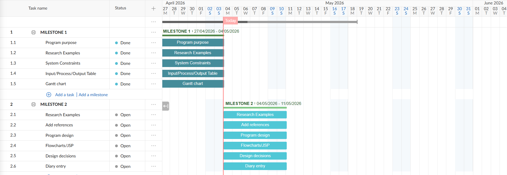

# IY4113 Milestone 1

| Assessment Details | Please Complete All Details                                             |
| ------------------ | ----------------------------------------------------------------------- |
| Group              | A                                                                       |
| Module Title       | IY4113 Applied Software Engineering using Object-Orientated Programming |
| Assessment Type    | Java Fundamentals Part 1                                                |
| Module Tutor Name  | Shore, Jonathan                                                         |
| Student ID Number  | T0496112                                                                |
| Date of Submission | 5/4/2026                                                                |
| Word Count         | 1600                                                                    |

- [x] *I confirm that this assignment is my own work. Where I have referred to academic sources, I have provided in-text citations and included the sources in
  the final reference list.*

- [x] *Where I have used AI, I have cited and referenced appropriately.

------------------------------------------------------------------------------------------------------------------------------

### Purpose of the Program

------------------------------------------------------------------------------------------------------------------------------

The purpose of this program is to make a public transport journey tracker using Java. The program lets the user add journeys for one day and work out the fare and apply discounts and daily caps and view or manage the journeys while the program is running.

### Core Program Functionality

We have 8 main functions:

- **Manage journeys**
  
  - Store the journeys entered by the user while the program is running.
  - Give each journey its own ID.

- **Add a journey**
  
  - Ask the user for the date, starting zone, destination zone, time band, and passenger type.
  - Check that the details entered are correct.
  - See how many zones the journey covers.

- **Calculate fare**
  
  - Find the correct ticket price based on the zones and time band.
  - Apply the correct discount for the passenger type.
  - Apply the daily cap if the passenger has reached the limit.
  - Save the final price charged for the journey.

- **List journeys**
  
  - Show all journeys added so far.
  - Show details such as ID, date, zones, time band, passenger type, and fare.

- **Filter journeys**
  
  - Search journeys by passenger type.
  - Search journeys by time band.
  - Search journeys by zone.
  - Search journeys by date.

- **Remove journeys**
  
  - Remove a journey by using its ID.
  - Update the totals after the journey is removed.

- **Reset day**
  
  - Clear all journeys and totals after the user confirms.

- **View summaries**
  
  - Show the total number of journeys.
  - Show the total amount spent.
  - Show the average journey cost.
  - Show the most expensive journey.
  - Show totals by passenger type.
  - Show counts for peak and off-peak journeys.

### System Constraints

We have 12 System Contraints 

- **No saving**: journeys are only stored while the program is open.

- **Console only**: the program uses text menus and keyboard input.

- **One day only**: the program is made for journeys in one day/session.

- **Zone limit**: zones can only be from 1 to 5.

- **Time band limit**: time band can only be Peak or Off-peak.

- **Passenger type limit**: passenger type can only be Adult, Student, Child, or Senior Citizen.

- **Fare data rule**: the program must use the fare data given in the assignment and should not change it.

- **Zone rule**: the program must count all zones included in the journey, including the start and end zones.

- **Daily cap rule**: the total amount charged for each passenger type must not go over its daily cap.

- **Input rule**: wrong inputs such as blank answers, wrong zones, non-number zones, wrong passenger type, and wrong time band will not be accepted.

- **Error rule**: the program should show an error message and ask again instead of closing.

- **Session rule**: journey IDs are only unique while the program is running, because the program does not save anything after it closes.

------------------------------------------------------------------------------------------------------------------------------

### Input Process Output Table

------------------------------------------------------------------------------------------------------------------------------

------------------------------------------------------------------------------------------------------------------------------

| Feature / Task           | Inputs                                                        | Processing (what the system does)                                                                           | Outputs                                           |
| ------------------------ | ------------------------------------------------------------- | ----------------------------------------------------------------------------------------------------------- | ------------------------------------------------- |
| Start program            | None                                                          | The program starts and prepares an empty list for journeys                                                  | Main menu is displayed                            |
| Display main menu        | User menu choice                                              | The program checks the user choice and opens the correct option                                             | The selected option is shown                      |
| Add a journey            | Date, start zone, destination zone, time band, passenger type | The program takes the journey details from the user                                                         | Journey details are entered                       |
| Check journey details    | Journey details entered by the user                           | The program checks that the zones, time band, and passenger type are correct                                | Details are accepted or an error message is shown |
| Count zones travelled    | Start zone and destination zone                               | The program counts all zones included in the journey and including the start and end zones                  | Number of zones travelled is found                |
| Calculate fare           | Zones travelled, time band, and passenger type                | The program finds the correct ticket price and then applies the passenger discount and checks the daily cap | Final fare for the journey is calculated          |
| Store journey            | Valid journey details and final fare                          | The program gives the journey an ID and saves it during the current run                                     | Journey is added successfully                     |
| List journeys            | Menu choice                                                   | The program reads all journeys added so far                                                                 | All journeys are displayed                        |
| Filter journeys          | Filter choice and search value                                | The program will search journeys by passenger type and time band, zone and date                             | Matching journeys are displayed                   |
| Remove journey           | Journey ID                                                    | The program checks if the ID exists and removes the journey if confirmed                                    | Journey is removed or an error message is shown   |
| Reset day                | User confirmation                                             | The program clears all journeys and totals if the user confirms                                             | All journey data is cleared                       |
| Daily summary            | Saved journeys                                                | The program counts journeys and total cost and average cost and the most expensive journey                  | Daily summary is displayed                        |
| Totals by passenger type | Saved journeys                                                | The program groups journeys by passenger type and works out totals                                          | Passenger type totals are displayed               |
| Category counts          | Saved journeys                                                | The program counts peak and off-peak journeys and zone                                                      | Category count are displayed                      |
| Exit program             | Exit choice                                                   | The program stops running                                                                                   | Goodbye message is displayed                      |

------------------------------------------------------------------------------------------------------------------------------

------------------------------------------------------------------------------------------------------------------------------

### Gantt Chart

------------------------------------------------------------------------------------------------------------------------------

HIGH QUALITY WILL BE PROVIDED IF ASKED

------------------------------------------------------------------------------------------------------------------------------

### Diary Entries

------------------------------------------------------------------------------------------------------------------------------

### Diary Entries

### 1/05/2026  Diary Entry 1: Understanding the Program

Today, I began by reading the CityRide Lite assignment briefly and carefully. Before writing about the planning section I wanna understand what the program actually needs. So, from the brief, I understand that this program is like the Java journey tracker used for public transport. It needs the user’s journey for a particular single day, calculates that journey cost, applies discounts and daily caps, and then manages the journey overall while the program is running. 
I also wanna share some main components that a program actually needs which include adding, listing, filtering, and removing journeys, resetting the day, and showing summaries. I also noted down some important rules that are using only zones 1-5, accepting the valid passengers for the journey, and also checking for peak or off-peak journeys. 
The only problem I had was understanding how actually fare cap works. At the beginning, I thought that every journey would have its normal prices but after reading the brief I understand every passenger have its own limit of journey if that limit is reached the other journeys travelled by the passenger will not cost any extra money beyond that limit that thing helps me to understand that the program actually needs to maintain the total route costs separately for every passenger type.

### 03/05/2026 Diary Entry 2: Planning the Work and IPO Table

Today I worked on the IPO table and Gantt chart. For the IPO table, I divided the program into its smaller tasks to do so I can look at which part of it needs input, what system does, and what output is shown like for instance when we add the journey the user enters the date, starting the zone to its destination zone, time band, and also the type of passenger. The system reviews the details and counts the zones of the passenger, calculating the fare, applies the discounts with a cap, and finally saves the journey.  
I also Create gantt chart to prepare the plan of work from start to end of assignment submission. I included milestone 1 for the analysis and the planning, milestone 2 for research and the design, and milestone 3 for initiating the coding, and milestone 4 for finishing and upgrading the program at last  I also added time for  GitHub uploads, and the final submission 
I also looked at the NTIC programming guide so I can figure out how the code can be written later. I knew that in the code we must use clear names with separate techniques and a proper Java structure. I must avoid putting so much in one big method, because that can make a program difficult to read and fix. 
One issue I caught is that the program has so many features that could be so confusing if I ever try to build them all at a single time. To resolve this, I plan to work step by step. Firstly I will begin with the menu and journey storage to fare calculation, filtering removing the journeys, and summaries.

------------------------------------------------------------------------------------------------------------------------------
