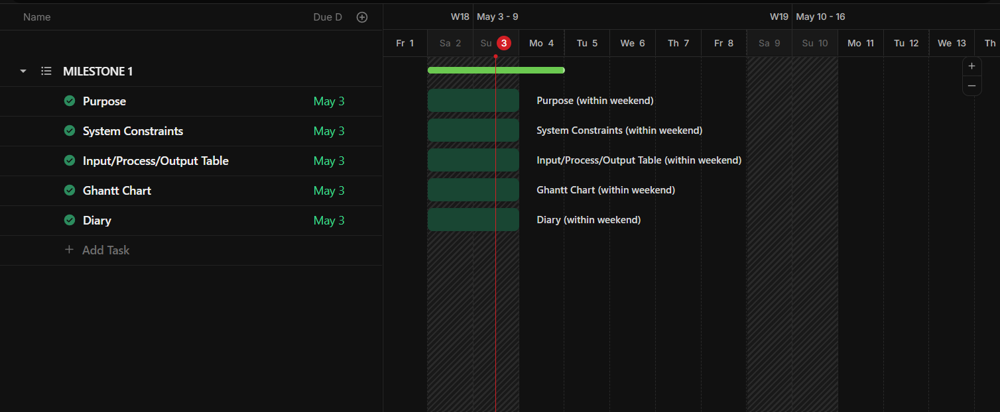

# IY4113 Milestone 1

| Assessment Details | Please Complete All Details                                             |
| ------------------ | ----------------------------------------------------------------------- |
| Group              | A                                                                       |
| Module Title       | IY4113 Applied Software Engineering using Object-Orientated Programming |
| Assessment Type    | Java Fundamentals Part 1                                                |
| Module Tutor Name  | Shore, Jonathan                                                         |
| Student ID Number  | T0496112                                                                |
| Date of Submission | 5/4/2026                                                                |
| Word Count         |                                                                         |

- [x] *I confirm that this assignment is my own work. Where I have referred to academic sources, I have provided in-text citations and included the sources in
  the final reference list.*

- [x] *Where I have used AI, I have cited and referenced appropriately.

------------------------------------------------------------------------------------------------------------------------------

### Purpose of the Program

------------------------------------------------------------------------------------------------------------------------------

THE PURPOSE OF THIS PROGRAM TO SIMULATE A PUBLIC TRANSPORT JOURNEY FARE TRACKER IN A CONSOLE-BASED JAVA APPLICATION WHICH WILL  ALLOW  USER TO ADD JOURNEYS, CALCULATE FARES, APPLY PASSENGER DISCOUNTS, CHECK DAILY CAPS, AND VIEW JOURNEY SUMMARIES DURING A SINGLE RUN OF THE PROGRAM.

------------------------------------------------------------------------------------------------------------------------------

### Input Process Output Table

------------------------------------------------------------------------------------------------------------------------------

*Add IPO table (It maybe easier to create the table in Word ad paste as an image!)*

------------------------------------------------------------------------------------------------------------------------------

### Gantt Chart

------------------------------------------------------------------------------------------------------------------------------

------------------------------------------------------------------------------------------------------------------------------

### Diary Entries

------------------------------------------------------------------------------------------------------------------------------

*Add diary entries here detailing what you have done, wny you have done it, and any problems encountered.*

------------------------------------------------------------------------------------------------------------------------------
