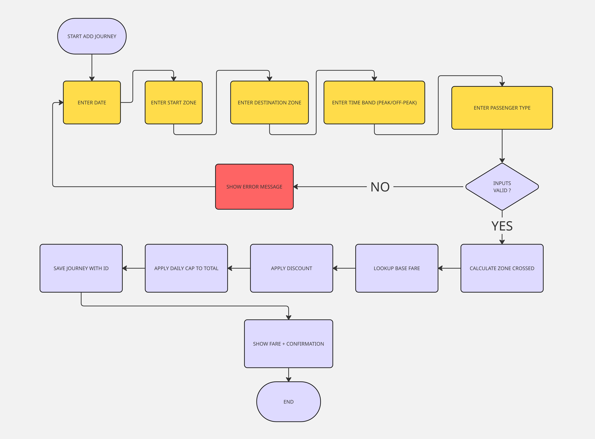
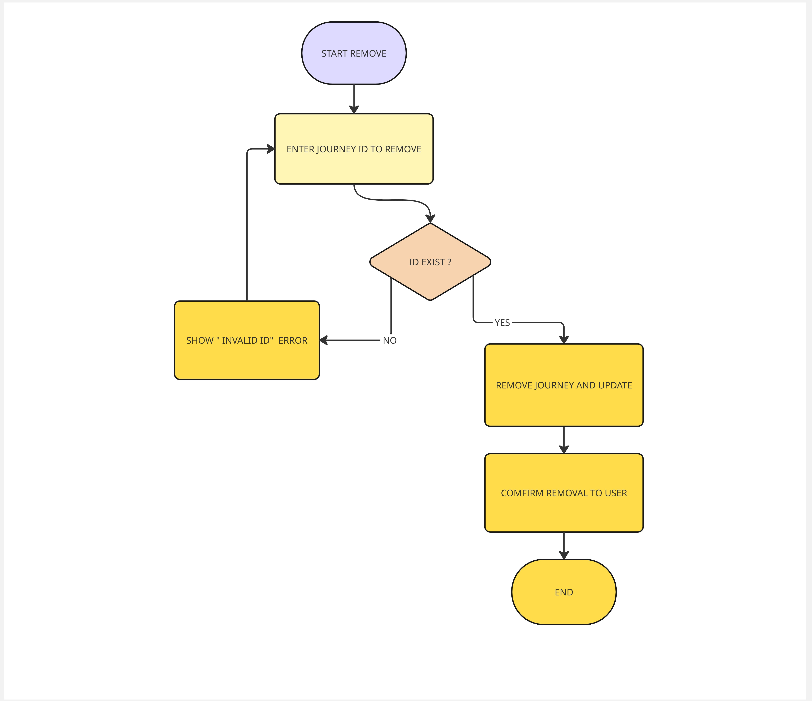
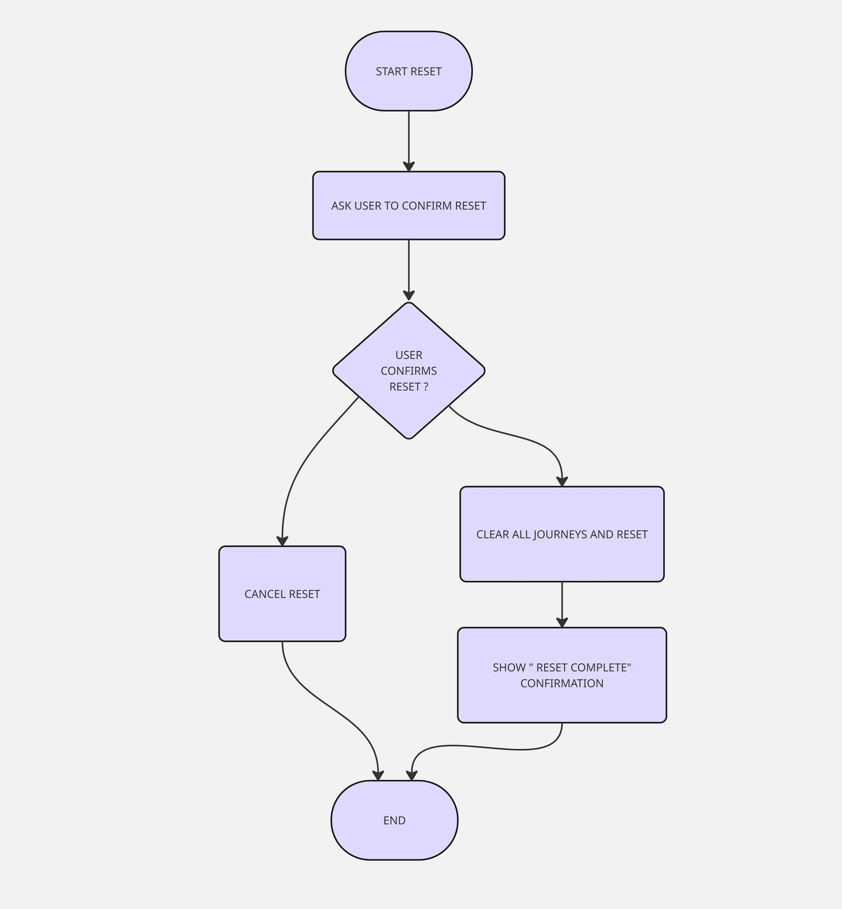
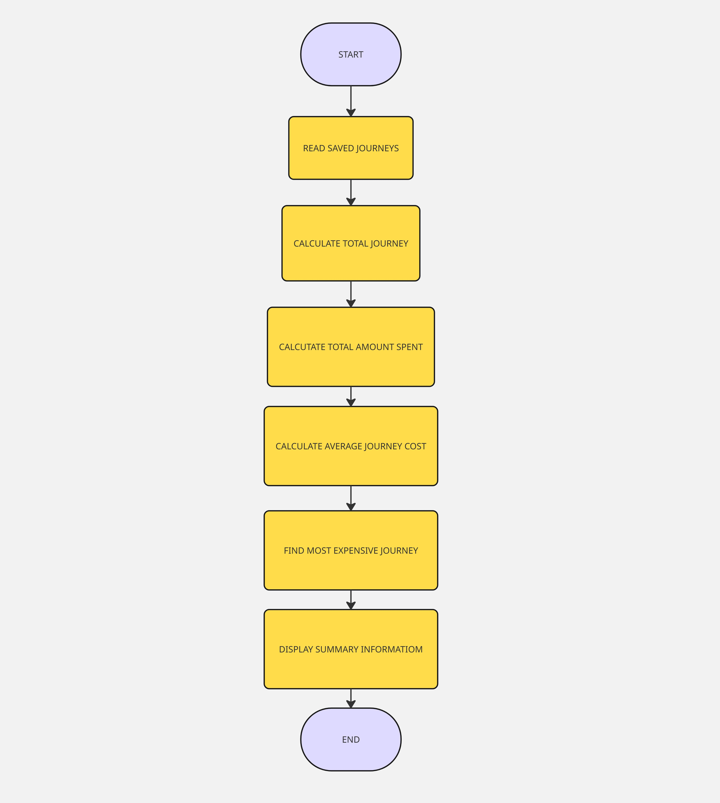
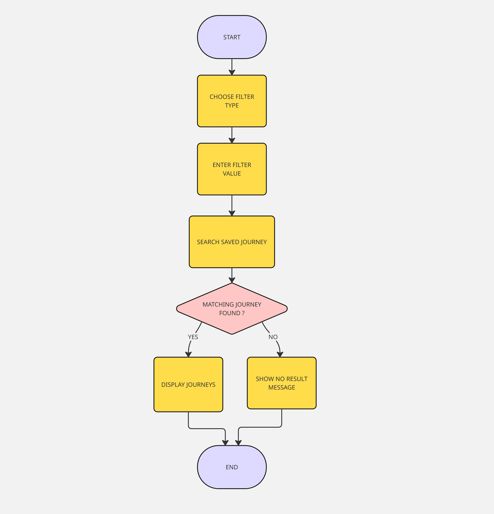

# IY4113 Milestone 2

| Assessment Details | Please Complete All Details                                             |
| ------------------ | ----------------------------------------------------------------------- |
| Group              | A                                                                       |
| Module Title       | IY4113 Applied Software Engineering using Object-Orientated Programming |
| Assessment Type    | Java Fundamentals Part 1                                                |
| Module Tutor Name  | Shore, Jonathan                                                         |
| Student ID Number  | T0496112                                                                |
| Date of Submission | 5/10/2026                                                               |
| Word Count         |                                                                         |

- [x] *I confirm that this assignment is my own work. Where I have referred to academic sources, I have provided in-text citations and included the sources in
  the final reference list.*

- [x] *Where I have used AI, I have cited and referenced appropriately.

------------------------------------------------------------------------------------------------------------------------------

### Algorithm Design

------------------------------------------------------------------------------------------------------------------------------

### 1 : Add Journey Flowchart

### 2 : Remove Journey Flowchart

 

### 3 : Reset Day Flowchart

### 4 : View Summary Flowchart

### 5 : Filter Journey Flowchart

- *Add **images** for the design of your algorithm. Choose either Flowchart or JSP diagrams to demonstrate the functional elements of the algorithm. There should be multiple images for this part as you are decomposing the problem into smaller elements.*

- *Include a class diagram to demonstrate the class structure of the proposed program design.*

------------------------------------------------------------------------------------------------------------------------------

### Research (minimum of 1 required, preferably 2)

------------------------------------------------------------------------------------------------------------------------------

*Research existing programs that solve a similar problem. The program does not have to be written in java or object orientated in nature - just solve a similar type of problem.* 

*Use the strucutre below to capture your evidence:*

------------------------------------------------------------------------------------------------------------------------------Name of program:

Reference (link):

What it does well (2-3 features that work effectively):

What it does poorly (at least 1 feature):

Key design ideas you could reuse (e.g., layout, navigation, input/output, program structure):

Screenshot (showing the interface/output):

------------------------------------------------------------------------------------------------------------------------------

### Updated Gantt Chart

------------------------------------------------------------------------------------------------------------------------------

Add your updated Gantt chart here!

------------------------------------------------------------------------------------------------------------------------------

### Diary Entries

------------------------------------------------------------------------------------------------------------------------------

### 5/9/2026 Diary Entry 1: Algorithm Design

*Add diary entries here detailing what you have done, wny you have done it, and any problems encountered.*

------------------------------------------------------------------------------------------------------------------------------
