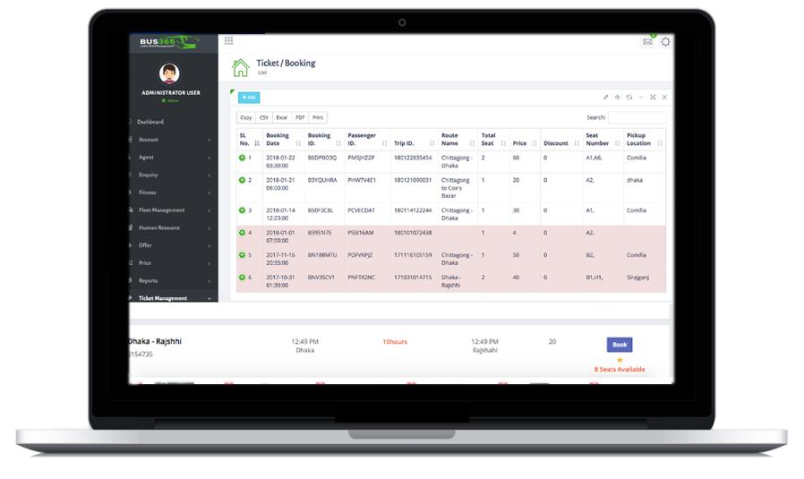

# IY4113 Milestone 2

| Assessment Details | Please Complete All Details                                             |
| ------------------ | ----------------------------------------------------------------------- |
| Group              | A                                                                       |
| Module Title       | IY4113 Applied Software Engineering using Object-Orientated Programming |
| Assessment Type    | Java Fundamentals Part 1                                                |
| Module Tutor Name  | Shore, Jonathan                                                         |
| Student ID Number  | T0496112                                                                |
| Date of Submission | 5/10/2026                                                               |
| Word Count         |                                                                         |

- [x] *I confirm that this assignment is my own work. Where I have referred to academic sources, I have provided in-text citations and included the sources in
  the final reference list.*

- [x] *Where I have used AI, I have cited and referenced appropriately.

------------------------------------------------------------------------------------------------------------------------------

### Algorithm Design

------------------------------------------------------------------------------------------------------------------------------

### 1 : Overall Program Flowchart

### 2 : Add Journey Flowchart

### 3 : Remove Journey Flowchart

 

### 4 : Reset Day Flowchart

### 5 : View Summary Flowchart

### 6 : Filter Journey Flowchart

------------------------------------------------------------------------------------------------------------------------------

### Research (minimum of 1 required, preferably 2)

------------------------------------------------------------------------------------------------------------------------------

### **Name of program:**

Transport Management System

---

### **Reference (link):**

[https://github.com/sixtusagbo/transport_management_system](https://github.com/sixtusagbo/transport_management_system?)

---

### **What it does well:**

- Separates passenger and booking and payment functionality into organised components
- Uses a clear dashboard and structured navigation system
- Handles transport data such as bookings and tickets and journeys effectively

---

### **What it does poorly:**

- The system is relatively complex for smaller student projects
- Some parts rely heavily on external frameworks and configuration files

---

### **Key design ideas you could reuse:**

I Might use these ideas for my program

- Menu and dashboard navigation structure for better user flow
- Separation of booking and passenger and payment into different modules
- Structured handling of journey and fare information

------------------------------------------------------------------------------------------------------------------------------

------------------------------------------------------------------------------------------------------------------------------

### Updated Gantt Chart

------------------------------------------------------------------------------------------------------------------------------

HD PICTURES WILL BE PROVIDED IF ASKED

------------------------------------------------------------------------------------------------------------------------------

### Diary Entries

------------------------------------------------------------------------------------------------------------------------------

### 5/8/2026 Diary Entry 1: Algorithm Design

Today I have looked into the algorithm design section of the assignment. I made the main program flowchart and a separate flowcharts of their main system functions which includes Add Journey, Filter Journeys, excluding Journey, Reset Day, and View Summaries. I did this because the assignment requires the problem to be broken down into smaller parts instead of showing everything in one large diagram so while creating the flowcharts I make sure to focus on making the program flow logically so it can be easy to follow. I made sure the diagrams showed the correct ordering of steps like writing down journey details, calculating fares, searching journeys and moving back to the main menu. The only problem I faced was that the overall program flowchart was too large and it was difficult to organise properly. Firstly, some branches looked messy because many functions were attached together. To resolve this, I simplified this overall flowchart which makes the diagrams much easier to read and more suitable for the analysis and design stage of the assignment.

### 5/9/2026 Diary Entry 1: Research & Update Gannt Chart

Today I examined the same transport management systems on GitHub
to help and improve my own project and as I am new to GitHub it was difficult at first time to figure out how to search for projects and explore repositories and find systems identical to my program and I have spent time learning how GitHub actually works.

After exploring different repositories I found a project named Transport Management System which was identical to my program the system supervises transport bookings and payments and tickets and passengers and journeys.

One thing the project has done well is distancing passenger and booking and payment functionality into organised components and It also uses a exact dashboard and a structured navigation system which creates the application very easier.

I also noticed some flaws the project is complicated for smaller projects and some things depend on external factors and configuration files.

The main component I want to reuse from this examination is the menu dashboard and navigation structure because it provides the programa better organised and easy to understand design.

------
