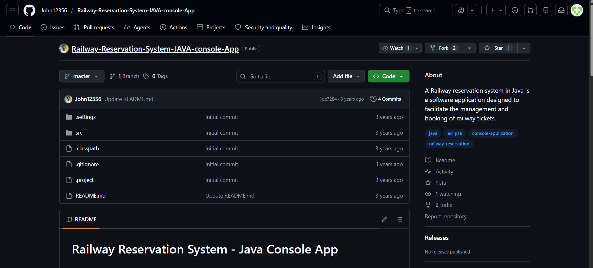
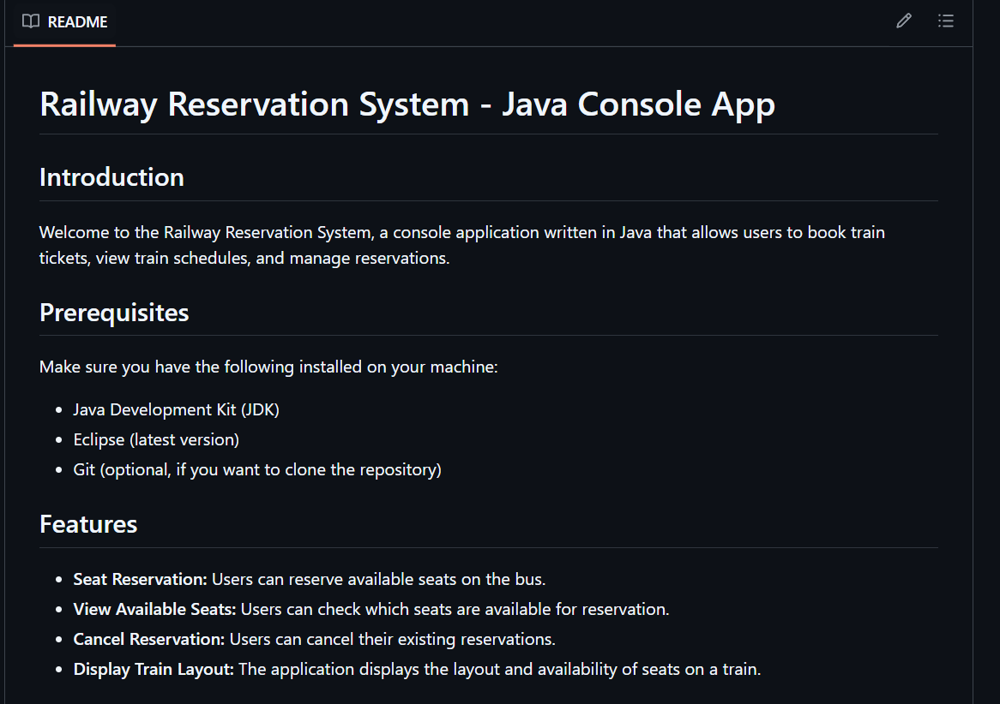
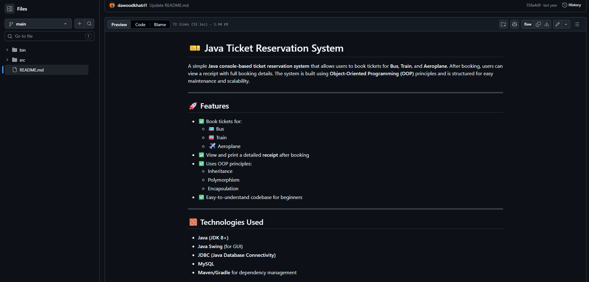
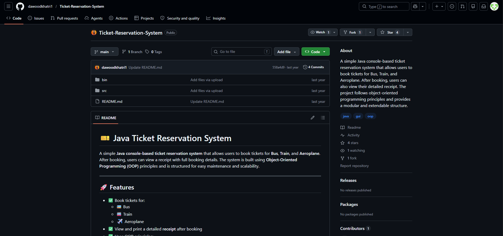
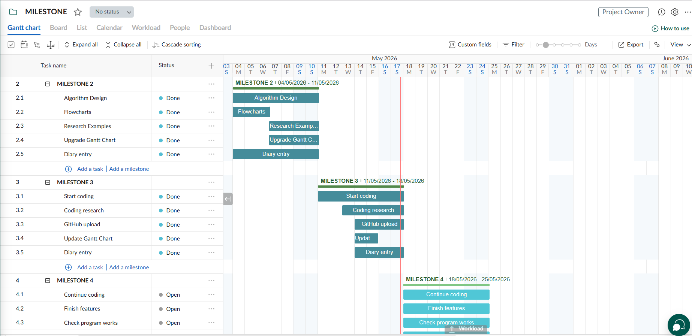

# IY4113 Milestone 3

| Assessment Details | Please Complete All Details                                             |
| ------------------ | ----------------------------------------------------------------------- |
| Group              | A                                                                       |
| Module Title       | IY4113 Applied Software Engineering using Object-Orientated Programming |
| Assessment Type    | Java Fundamentals Part 1                                                |
| Module Tutor Name  | Shore, Jonathan                                                         |
| Student ID Number  | T0496112                                                                |
| Date of Submission | 17/05/2026                                                              |
| Word Count         | 1160                                                                    |

- [x] *I confirm that this assignment is my own work. Where I have referred to academic sources, I have provided in-text citations and included the sources in
  the final reference list.*

- [x] *Where I have used AI, I have cited and referenced appropriately.

------------------------------------------------------------------------------------------------------------------------------

### Research (minimum of 2, at least 3)

---

### Research : 1

---

Title of research:

Railway Reservation System - Java Console App

Reference (link):

https://github.com/John12356/Railway-Reservation-System-JAVA-console-App

**1: How does the research help with coding practise?:**

this research helped me because it is a Java console application for booking train tickets and managing reservations and It is useful for my CityRide Lite program because the program use a menu system and allow the user to enter travel information and It helped me understand how a transport program can be started using simple Java classes and console input

**2: Key coding ideas you could reuse in your program:**

the main idea I could reuse is a simple menu where the user can choose different options and I can use this idea to add journey and list journeys and remove journey and reset day and exit and I am not copying the code but I used it to understand the structure of a transport console program

**Screenshot of research:**

---

### Research : 2

---

Title of research:

Java Ticket Reservation System

Reference (link):

https://github.com/dawoodkhatri1/Ticket-Reservation-System

**1: How does the research help with coding practise?:**

this research helped me because it is a simple Java consol based ticket reservation system and it also uses uses oop programming and separates the program into parts which also helped me understand why I should create different files like Journey.java and CityRideService.java.

**2: Key coding ideas you could reuse in your program:**

the main idea I could reuse is separating the journey details from the main program actions and in my project  journey.java stores one journey and cityrideservice.java will later manage the journey list and I am only using this as design inspiration

**Screenshot of research:**

---

### Program Code

---

the program is still in the starting coding stage for Milestone 4 the code below shows the Journey.java model class and the beginning of the CityRideService.java service class The full program is not complete yet

---

#### Journey.java

---

package model;

import data.CityRideDataset;

public class Journey {

private int id;
private String date;
private int fromZone;
private int toZone;
private CityRideDataset.TimeBand timeBand;
private CityRideDataset.PassengerType passengerType;

public Journey(int id, String date, int fromZone, int toZone,
               CityRideDataset.TimeBand timeBand,
               CityRideDataset.PassengerType passengerType) {
    this.id = id;
    this.date = date;
    this.fromZone = fromZone;
    this.toZone = toZone;
    this.timeBand = timeBand;
    this.passengerType = passengerType;
}

public int getId() {
    return id;
}

public int getFromZone() {
    return fromZone;
}

public int getToZone() {
    return toZone;
}

public int getZonesCrossed() {
    return Math.abs(toZone - fromZone) + 1;
}

public String showJourneyDetails() {
    return "ID: " + id
            + " | Date: " + date
            + " | From zone: " + fromZone
            + " | To zone: " + toZone
            + " | Time: " + timeBand
            + " | Passenger: " + passengerType
            + " | Zones crossed: " + getZonesCrossed();
}

}

---

#### CityRideService.java

---

package service;

import data.CityRideDataset;
import model.Journey;

import java.util.ArrayList;

public class CityRideService {

// This list stores journeys while the program is running.
private ArrayList<Journey> journeys;
private int nextJourneyId;

public CityRideService() {
    journeys = new ArrayList<>();
    nextJourneyId = 1;
}

public void addJourney(String date, int fromZone, int toZone,
                       CityRideDataset.TimeBand timeBand,
                       CityRideDataset.PassengerType passengerType) {
    Journey journey = new Journey(nextJourneyId, date, fromZone, toZone, timeBand, passengerType);

journeys.add(journey);
nextJourneyId++;

System.out.println("Journey added.");

}

}

---

------------------------------------------------------------------------------------------------------------------------------

### Updated Gantt Chart

------------------------------------------------------------------------------------------------------------------------------

HD PICTURES WILL BE PROVIDED IF ASKED

------------------------------------------------------------------------------------------------------------------------------

### Diary Entries   5/15/2026 to 5/16/2026

------------------------------------------------------------------------------------------------------------------------------

Today for milestone 3 i worked on it and i have made my first github commit in which i made a java project structure with adding the teacher's cityridedataset.java file and i four created different separate folders in src, which were data and main and model and service and the aim of doing this was to make the program organised instead of adding everything in one file. the data folder is for putting the dataset given by the teacher and model includes information about the journey and the service is for the actions of the main program and main will be used later to start the program

the second commit i made is the journey.javaclass. in this class every journey has its own information like id and date and starting zone and destination zone and time band and passenger type and i added the dataset of the teacher in this file as the passenger type and time band are already included in cityridedataset.java so there was no need to make a separate file for it. 

the difficult part of today was to understand how java files get connected to each other by using packages and imports as i am still understanding github and java project structure this has taken so much time i also had to do research work with examples which was also difficanltand the flowcharts done previously to understand which class to make first now i have understood that the journey.java class stores one journey until i add other features later.

------------------------------------------------------------------------------------------------------------------------------

### Diary Entries: 2     5/17/2026

---

Today i worked on the third github commit and started forming the cityrideservice.java class separately because i did not want to do everything in one file. this service class will be used to work with journey data and start the actions of the program. 

in this cityrideservice.java i began to use an arraylist for storing journey details while the program is running and as the journey only needs to be stored for a day or session. i also began the addjourney method which creates a journey object and stores it in the list and gives it an id and prints a message that the journey has been added. 

the coding system is still difficult for me especially when i have to know where each piece of the code should go as i am still learning to use github properly making it into smaller commits helped me a lot to figure out my progress in a better way.

---

### REFERENCES :

---

freeCodeCamp.org. (2018, October 16). Learn Java 8 - Full Tutorial for Beginners. [YouTube video]. Retrieved from: https://www.youtube.com/watch?v=grEKMHGYyns [Accessed 11 May 2026].

---

Bro Code. (2020, September 27). Java Full Course for free. [YouTube video]. Retrieved from: https://www.youtube.com/watch?v=xk4_1vDrzzo [Accessed 13 May 2026].
